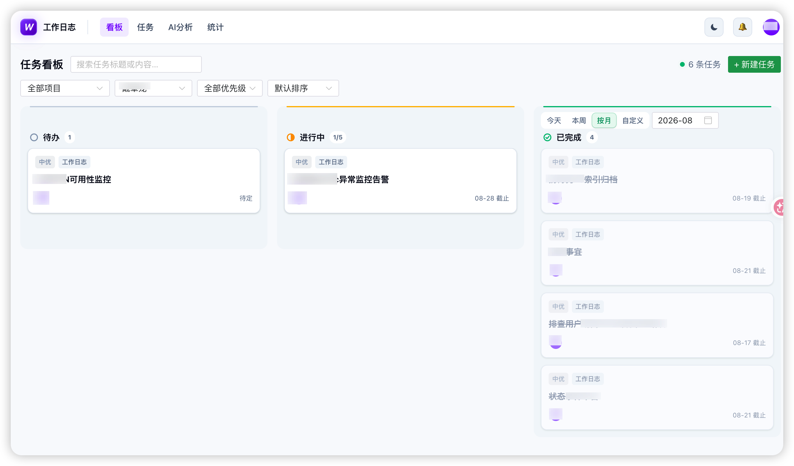
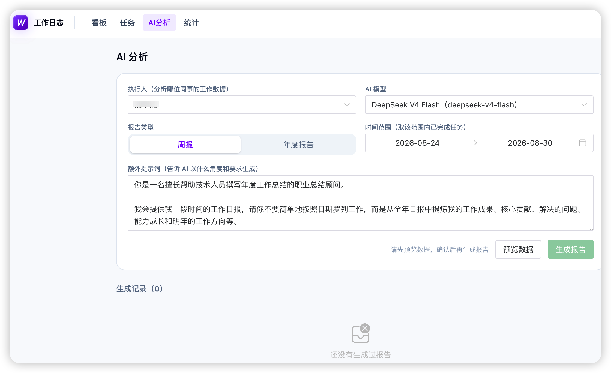

# 工作日志

团队协作的工作日志平台：日报 / 周报 / 月报、计划管理与到期提醒、工作数据统计分析。

## 界面预览

**任务看板**



**AI 分析**



## 使用场景（这个平台适合你吗）

如果你符合下面任何一条，这个平台大概率就是为你准备的：

- **公司要求写日报/周报，记录却散落在飞书里** —— 写在聊天工具里的日报，想回顾只能一条条翻记录；写年度总结时更要翻遍一整年的聊天。本平台把工作按「任务」结构化沉淀，随时检索、导出。
- **想给自己留档工作数据** —— 每天干了什么如实记录，汇报时有据可依——有数据能量化你的产出。注意：**这是一个记录平台，不是监督平台**，它不考核你每天必须完成多少工作量，初衷只是帮你留档。
- **不想写周报** —— 积累一定数据后，选个时间范围调用 AI 即可生成周报 / 年度总结，不用再逐个回忆"那段时间到底干了什么"（是的，作者也不喜欢写周报）
- **怕遗忘未来的任务** —— 记录一个未来才开始的任务，开始当天中午 12 点飞书准时提醒你，不怕遗忘，不耽误任务和项目进度。
- **跨天任务怕烂尾** —— 任务横跨多天、截止日仍未完成时会收到一次提醒。但提醒完全可选——平台不想制造"任务焦虑"，提不提醒是你的自由。

## 功能

- **看板（时间线视图）**：按日期分组展示任务时间线，支持 今天 / 本周 / 按月 / 自定义范围 切换，项目与状态过滤，行内标记完成，30s 轮询；时间过滤只作用于「已完成」列，待办与进行中始终展示；把任务拖回「待办」会清空开始/截止日期与提醒（表示尚未排期），从待办拖出时若未排期则开始日期自动补为当天
- **新建任务**：单入口弹窗——内容分两层：「正文」写任务总结（纯文本，要求简短），勾选「详细内容」后展开富文本编辑器补充过程细节/截图/日志（取消勾选且有内容时弹确认防误清）；富文本基于 wangEditor，支持插入图片与附件（附件经服务端中继上传到阿里云 OSS，单个不超过 500M）；开始日期 / 截止日期（均默认当天）、到期提醒默认勾选（截止日当天 18:00 站内通知 + 飞书提醒作者与负责人）、开始日期选未来时出现「开始提醒」勾选（默认勾选，开始日当天 12:00 提醒）、截止日期选未来时「已完成」默认勾选自动取消、「已完成」勾选（取消勾选进入进行中）、负责人（默认自己）、参与人（多选）
- **待办与排期**：勾选「待办」会清空开始/截止日期（表示还没决定什么时候开始，日后再排期）；开始日期选未来的任务也自动进入「待办」列（同时取消「已完成」勾选），开始当天 00:10 由定时任务自动转入「进行中」（12:00 与启动时补跑，幂等）；编辑待办任务把开始日期排到「今天或之前」保存后也会立即进入「进行中」；未排期的待办任务从待办拖出（进行中/完成）时开始日期自动补为当天，保证报表可聚合
- **状态流转的日期联动**：任务完成时若未填截止日期自动补为当天；已完成的任务移回「进行中」时，已过期的截止日期（≤今天）自动清空，未来截止日期则保留
- **任务可见性**：看板中所有任务全员互相可见，任何登录用户均可评论；编辑 / 删除仅限任务提交人或管理员（状态流转还允许负责人操作）
- **任务**：任务清单按截止日期排序，临期 / 逾期高亮，我的 / 团队切换；进行中与已完成的任务点击可打开详情抽屉（含评论）
- **AI 分析**：选择同事 + 时间范围 + AI 模型，将该周期内已完成任务发给第三方大模型生成「周报 / 年度报告」；为控制数据量只提交 **标题 + 正文**（任务的「详细内容」不发送，避免日报量大时超出模型上下文上限）；提示词按报告类型自动加载系统设置中的默认值，可临时修改（仅本次生效），也可手动选用其他主题提示词；后端异步生成（刷新页面不影响），前端轮询状态；生成结果自动作为【AI生成】任务写入执行人的任务列表（负责人即执行人）；需先「预览数据」且已完成任务 ≥2 条才可生成；生成记录可由发起人或管理员删除（仅删报告记录，已写入任务的【AI生成】条目不受影响）
- **AI 模型配置（系统设置）**：内置 DeepSeek V4 Flash / Pro 两个模型，管理员可增删改、填 API Key、启用/停用；仅启用的模型可在 AI 分析页选用
- **AI 提示词（系统设置）**：内置「周报」「年度报告」两条默认提示词，AI 分析页按报告类型自动加载；管理员可编辑内置提示词内容（不可删除、不可变更关联类型），也可新增自定义主题提示词（不关联报告类型，在 AI 分析页手动选用）
- **附件存储配置（系统设置）**：管理员在「系统设置 → 附件存储」配置阿里云 OSS（Endpoint / Bucket / AccessKey ID / Secret / 目录前缀 / 自定义域名）；AK 仅保存在服务端不下发浏览器，上传经服务端中继；Bucket 需公共读或配置自定义域名；经 Nginx 反代时需 `client_max_body_size 500m` 放行大附件
- **统计**：ECharts 图表——成员工作量、项目分布、每日提交趋势
- **项目管理**：任何人可创建项目；编辑（名称/描述/负责人）、归档、删除仅管理员
- **成员管理（系统设置）**：仅管理员可见——右上角头像 →「系统设置」。可手动创建成员（预注册）、修改任何人名称；本人改名在「个人设置」。手动创建的成员之后用 Casdoor 登录且名称相同时自动关联绑定，历史数据保留
- **模拟身份（排查问题）**：管理员在系统设置成员列表点「模拟身份」，即以该成员视角访问平台（所见数据、权限与该成员一致）。模拟期间顶部显示琥珀色横幅，头像菜单与横幅上均有「退出模拟身份」，点击即恢复管理员身份。模拟会话中不可再次模拟他人
- **评论与 @提及**：评论输入框输入 `@` 可选择成员；评论中的 `@名字` 渲染为彩色文本，鼠标悬停显示该成员信息卡（姓名/邮箱）；被提及者收到站内通知，绑定飞书 open_id 后还会收到飞书消息（含评论内容与任务链接，点击直达任务详情）
- **权限**：工作内容仅创建者或管理员可删除；权限走平台内部角色（普通用户 / 管理员），系统设置中可管理角色并调整成员角色
- **到期/开始提醒**：cron 每天 18:00 扫描到期（任务按日期粒度管理，无需高频扫描）、12:00 提醒当天开始、00:10 将到达开始日期的待办任务自动转入「进行中」——勾选「到期提醒」的任务在截止日当天提醒作者与负责人；勾选「开始提醒」的任务在开始日当天 12:00 提醒作者与负责人；历史计划（kind=plan）临期 / 逾期提醒保留 → 平台内通知 + 飞书应用消息
- **认证**：本地账号密码登录（内置 admin 账号，首次登录强制改密）+ 统一认证（Casdoor OAuth2，仅作登录认证，可关闭走开发模式）
- **数据库约定**：不使用物理外键，表间关联仅靠字段值做逻辑映射（应用层保证一致性）；启动时自动清理历史外键约束

## 技术栈

| 层 | 技术 |
|----|------|
| 前端 `web/` | Vue3 + Vite + TypeScript + Tailwind CSS v4 + Naive UI + Pinia + ECharts + vuedraggable |
| 后端 `server/` | Go + Gin + GORM + robfig/cron |
| 数据库 | MySQL（自动建库建表） |
| 认证 | Casdoor（OAuth2 授权码流程） |
| 通知 | 飞书自建应用消息 API |

## 依赖组件（部署前必读）

本平台的完整体验依赖以下外部组件。**其中 Casdoor 与阿里云 OSS 是核心组件**：前者解决"谁是谁"的身份识别与鉴权问题，后者解决富文本图片/附件的存储问题，缺失任何一个都会明显影响使用。

| 组件 | 用途 | 缺失的影响 |
|------|------|-----------|
| MySQL 5.7+ / 8 | 数据存储 | **必需**，服务无法启动 |
| Casdoor | SSO 单点登录：登录自动创建/识别成员、自动绑定飞书 open_id | 退化为本地账号 + 开发模式登录，团队成员身份需手动维护，**生产环境强烈建议配置** |
| 阿里云 OSS | 任务「详细内容」中图片/附件的存储 | 无法插入图片与附件，详细内容只能写纯文字 |
| 飞书自建应用 | 任务开始/到期提醒、@提及的消息推送 | 提醒只剩站内通知，触达能力大打折扣 |
| 大模型 API（DeepSeek 等） | AI 生成周报 / 年度总结 | 「AI 分析」功能不可用 |

以上组件均在 `server/config.yaml` 或「系统设置」页面中配置，详见下文。

## 本地开发

前置：Go 1.24+、Node 20+、MySQL 8（可用 `docker run -d --name work-report-mysql -p 3307:3306 -e MYSQL_ROOT_PASSWORD=workreport123 -e MYSQL_DATABASE=work_report mysql:8.0` 快速起一个）。

```bash
# 1. 配置（开发模式：casdoor.enabled=false，任意名字直接登录）
cp server/config.example.yaml server/config.yaml
#    按需修改 database.dsn / casdoor / feishu

# 2. 启动后端（:8092，按 config.yaml 的 server.port）
make dev-server

# 3. 另开终端启动前端（:5173，/api 已代理到后端）
cd web && npm install
make dev-web
```

打开 http://localhost:5173 。

## 生产部署

前端构建产物（`web/dist`）**不内嵌**进 Go 二进制，两种部署模式任选：

### 模式一：Go 托管前端（同域部署）

```bash
make build          # 构建 web/dist + server/bin/server
# 上传 server/bin/server、config.yaml，以及 web/dist 目录
./server -conf config.yaml
```

`server.static_dir`（默认 `../web/dist`，相对于服务启动时的工作目录）指向 dist 目录即可，Go 会托管静态资源并对前端路由做 SPA fallback；`/api/` 下未匹配的路径返回 JSON 404。

### 模式二：Nginx 独立托管前端

前端 dist 交给 Nginx，`/api` 反代到 Go 服务（此时 Go 侧 `static_dir` 指向的目录不存在即为纯 API 模式）：

```nginx
server {
    listen 80;
    server_name your-domain;

    root /var/www/work-report/dist;   # web/dist 上传到这里
    index index.html;

    location /api/ {
        proxy_pass http://127.0.0.1:8092;
        proxy_set_header Host $host;
        proxy_set_header X-Real-IP $remote_addr;
        proxy_set_header X-Forwarded-For $proxy_add_x_forwarded_for;
        proxy_set_header X-Forwarded-Proto $scheme;
    }

    location / {
        try_files $uri $uri/ /index.html;   # SPA fallback
    }
}
```

生产配置要点：

- `server.mode: release`
- `jwt.secret` 换成强随机串
- `casdoor.enabled: true` 并填 `endpoint / client_id / client_secret / organization / application / redirect_uri`（redirect_uri 需在 Casdoor 应用登记，指向 `https://你的域名/callback`）
- `feishu.enabled: true` 并填自建应用的 `app_id / app_secret`；用户在自己「个人设置」里填飞书 open_id 后即可收到到期提醒与 @ 提及消息
- `app.url` 改为平台对外地址（如 `https://你的域名`），飞书消息中的任务链接使用该地址

## API 一览

```
POST /api/auth/login           本地账号密码登录（内置 admin，首次登录强制改密）
POST /api/auth/callback        Casdoor 回调换会话 token
POST /api/auth/dev-login       开发模式登录（casdoor.enabled=false 时）
POST /api/auth/change-password 修改本人密码（本地账号）
GET  /api/auth/me              当前用户
PUT  /api/auth/me              更新本人资料（绑定飞书 open_id）
GET  /api/users                用户列表
POST /api/users                手动创建成员（仅管理员，名称与统一认证显示名一致可自动关联）
PUT  /api/users/:id            修改成员名称/角色（角色仅管理员可改）
POST /api/users/:id/impersonate 模拟指定成员身份（仅管理员，返回目标用户视角的会话 token）
GET/POST /api/roles            角色列表 / 新建角色（写操作仅管理员）
PUT/DELETE /api/roles/:id      编辑 / 删除角色（仅管理员；内置角色不可删、仅可改描述）
GET/POST /api/projects         项目列表 / 创建（任何登录用户）
PUT/DELETE /api/projects/:id   更新（含归档）/ 删除（仅管理员）
GET/POST /api/work-items       工作内容列表 / 提交
                               过滤：project_id/author_id/kind/status/date_from/date_to/visible
                               done_date_from/done_date_to：只按时间过滤已完成任务（看板用）
                               visible=1 时按可见性过滤（提交人/负责人/参与人可见，管理员全见）
                               提交支持 assignee_id（默认提交人）、participant_ids、status
GET  /api/work-items/:id       单条查询（任务深链接 /board?item=ID 使用）
PUT/PATCH/DELETE /api/work-items/:id   编辑(仅作者) / 状态流转(/status) / 删除(作者或管理员)
GET/POST /api/work-items/:id/comments  评论列表 / 发表评论（任何登录用户）
                               评论中 @某人 会生成 mention 站内通知，并推送飞书（含任务链接）
DELETE /api/comments/:id       删除评论（评论作者或管理员）
GET  /api/reports?period=day|week|month&date=YYYY-MM-DD[&format=markdown]   报表聚合
GET  /api/stats?days=30        统计分析
GET  /api/ai-models/enabled    已启用 AI 模型列表（登录用户，选模型用，不含 api_key）
GET/POST /api/ai-models        AI 模型管理（仅管理员，含 api_key）
PUT/DELETE /api/ai-models/:id  编辑 / 删除模型（仅管理员；已被报告引用的不可删）
GET  /api/ai-prompts           AI 提示词列表（登录用户，AI 分析页加载默认提示词）
POST/PUT/DELETE /api/ai-prompts[/:id]  提示词管理（仅管理员；内置提示词不可删、不可改关联类型）
GET/POST /api/ai-reports       AI 报告列表（我发起的 + 我是执行人的）/ 创建生成任务（异步，已完成任务 <2 条拒绝）
GET  /api/ai-reports/:id       单条报告（前端轮询生成状态）
DELETE /api/ai-reports/:id     删除报告（发起人或管理员；生成中不可删）
GET/PUT /api/oss-config        阿里云 OSS 配置读取 / 保存（仅管理员；Secret 留空表示不修改）
POST /api/uploads              图片/附件上传（登录用户；multipart 字段 file，单文件 ≤500M，中继到 OSS）
GET  /api/notifications        通知列表    GET /api/notifications/unread-count  未读数
PATCH /api/notifications/:id/read       标记已读（id=all 全部已读）
```

## 数据模型

- **Role**：平台内部角色（内置 admin / user），`is_admin` 标识决定成员权限；内置角色不可删除
- **User**：统一认证首次登录自动创建（默认普通用户角色），也支持本地账号密码登录（`password_hash`）；`feishu_open_id` 用于提醒（Casdoor 登录时自动从 token 的 `sub` 字段绑定，也可在设置页手动修改）；`is_admin` 由关联角色派生
- **Project**：`name` + `owner_id`（负责人）必填，`status` active/archived
- **WorkItem**（核心，计划与工作内容统一模型）：`kind` = plan / work；`status` = todo / doing / done / cancelled；`content` 正文（任务总结，AI 分析与报表导出只取标题+正文）；`detail` 详细内容（可选第二层，仅详情页展示，不提交给 AI）；`work_date` 工作发生日（时间线与报表聚合依据，待办未排期任务为 NULL）；`due_date` 计划截止日（提醒依据）；`assignee_id` 负责人（默认提交人）；`participants` 参与人（many2many）
- **Comment**：工作内容下的评论，删除权限为评论作者或管理员
- **Notification** / **PlanRemindLog**：平台内通知与提醒去重记录
- **AIModel**：第三方 AI 模型配置（provider / model_id / api_key / base_url / enabled），仅启用后可被选用
- **AIReport**：AI 生成记录（执行人 / 模型 / 类型 week|year / 时间范围 / 提示词 / 状态 running|done|failed / 结果）；成功后回写 `work_item_id`（写入执行人任务的【AI生成】条目）
- **AIPrompt**：AI 分析提示词（主题名 / 关联报告类型 week|year|空 / 内容）；内置周报、年度报告两条（`built_in`，可编辑内容，不可删除、不可变更关联类型）；`report_type` 为空为自定义主题，AI 分析页手动选用
- **OSSConfig**：阿里云 OSS 单行配置（endpoint / bucket / access_key_id / access_key_secret / dir 目录前缀 / domain 自定义域名），仅管理员可读写；任务富文本的图片与附件经服务端中继上传
